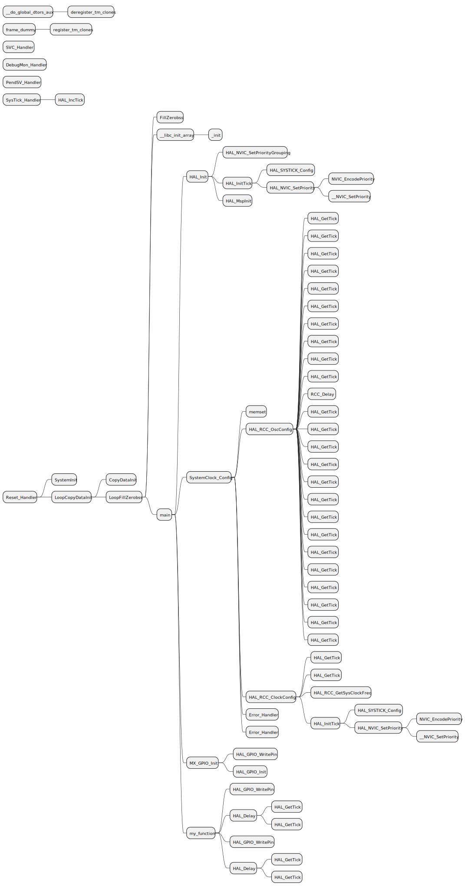

# elfcallgraph
A script could generate callgraph from elf file

# Depandency

## arm gcc
- arm-none-eabi-objdump

## python
- chardet (used to identify the text file encode)

## vs code extension
- PlantUML

# how to use
Run below command to generate callgraph from a elf:

```console
python .\callgraph.py .\debug.elf
```

Run below command to generate callgraph from a asm:

```console
python .\callgraph.py .\debug.s
```

Run below command to generate callgraph from a elf, with:

- callgraph start at *main*
```console
python .\callgraph.py .\debug.elf -c main
```

- callgraph start at *main*
- callgraph skip *HAL_RCC_OscConfig*
```console
python .\callgraph.py .\debug.elf -c main -f HAL_RCC_OscConfig
```

- callgraph start at *main*
- callgraph skip *HAL_RCC_OscConfig*
- callgraph deepth 4
```console
python .\callgraph.py .\debug.elf -c main -f HAL_RCC_OscConfig -d 4
```

- callgraph start at *main*
- callgraph skip *HAL_RCC_OscConfig*
- callgraph deepth 4
- callgraph output *callgraph.pu*
```console
python .\callgraph.py .\debug.elf -c main -f HAL_RCC_OscConfig -d 4 -o callgraph.pu
```

Run below command to get help:
- python .\callgraph.py -h

## generated files
- debug.s (disassembler file)
- debug.pu (PlantUML Mindmap file)

## Use VS Code PlantUML extension to review the callgraph (PlantUML Mindmap file "debug.pu")
A callgraph with commands:
- callgraph start at *main*
- callgraph skip *HAL_RCC_OscConfig*
```console
python .\callgraph.py .\debug.elf -c main -f HAL_RCC_OscConfig
```
