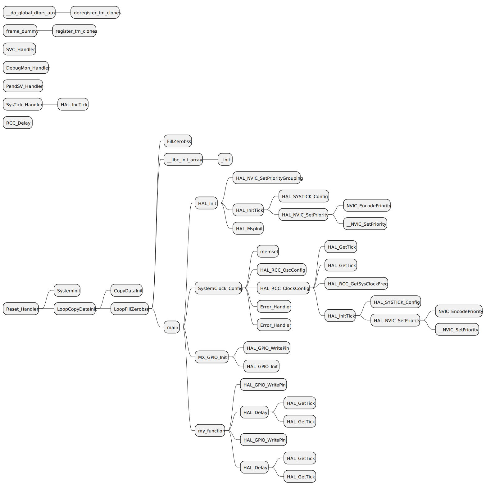

# elfcallgraph
A script could generate callgraph from elf file

This tool depands on the arm-none-eabi-objdump

# Depandency

## python dependency
- chardet (used to identify the text file encode)

## vs code extension dependency
- PlantUML

# how to use
Run below command to generate callgraph from a elf:
- python .\callgraph.py .\debug.elf

Run below command to generate callgraph from a elf with main as start:
- python .\callgraph.py .\debug.elf -c main

Run below command to generate callgraph from a elf with *main* as start and skip *HAL_RCC_OscConfig*:
- python .\callgraph.py .\debug.elf -c main -f HAL_RCC_OscConfig

Run below command to get help:
- python .\callgraph.py -h

## generated files
- debug.s (disassembler file)
- debug.pu (PlantUML Mindmap file)

## Use VS Code PlantUML extension to review the callgraph (PlantUML Mindmap file "debug.pu")
A callgraph with *main* as start and skip *HAL_RCC_OscConfig*:
